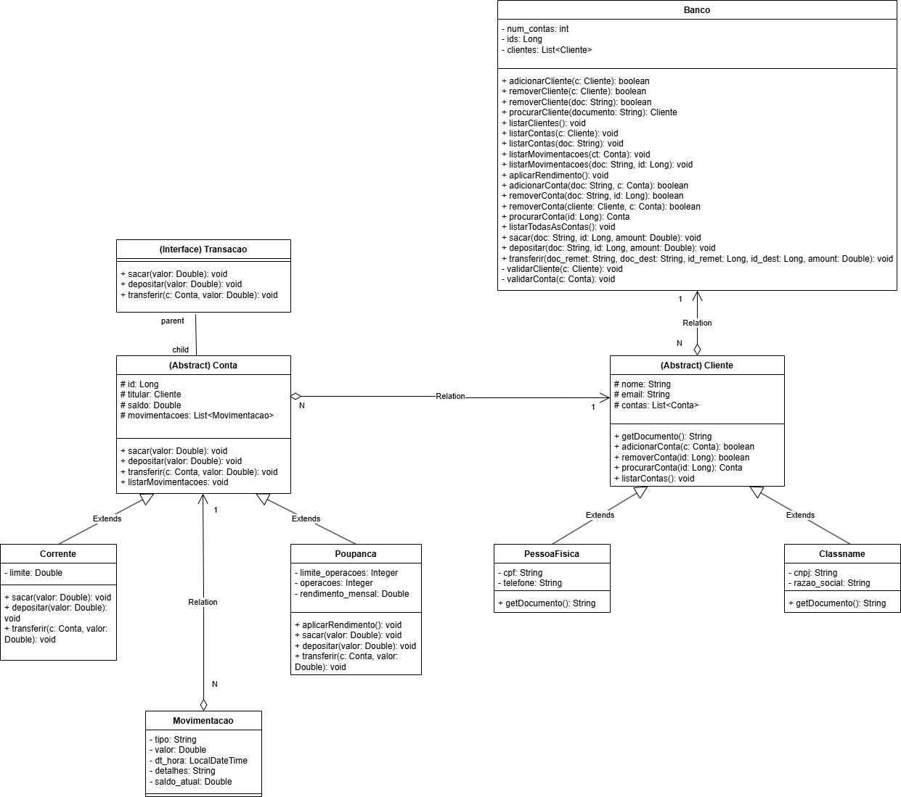

# 💰 Banco Simplificado

Um projeto em Java que simula um sistema bancário com funcionalidades básicas.

## Cenário do Problema

O projeto representa uma aplicação de terminal para gerenciar um banco de forma simplificada.

### Funcionalidades disponíveis

- Adicionar cliente (PF ou PJ)
- Adicionar conta (Corrente ou Poupança)
- Listar clientes, contas ou movimentações
- Sacar valor de uma conta
- Depositar valor em uma conta
- Realizar transferência entre contas
- Aplicar rendimento mensal às contas poupança

Esse sistema foi desenvolvido para a matéria de Desenvolvimento de Sistemas Orientados a Objeto da 3ª fase do Curso Ciência da Computação IFSC-Lages
  
## Tecnologias utilizadas

- Java 21
- Padrões de Projeto (orientação a objetos, herança, polimorfismo)

## Estrutura do Projeto

- `Main.java`: contém o loop principal e o menu de operações.
- `Banco.java`: gerencia clientes, contas e movimentações.
- `Cliente.java`, `PessoaFisica.java`, `PessoaJuridica.java`: hierarquia de clientes.
- `Conta.java`, `Corrente.java`, `Poupanca.java`: hierarquia de contas.
- `Movimentação.java`: Registro das movimentações.
- Exceções personalizadas: `InputInvalidoException`, `ClienteNotFoundException`, `ContaNotFoundException`, etc.

### Diagrama uml do sistema


## Como executar

1. **Clone o repositório:**
   ```bash
   git clone https://github.com/ViniciusCorbellini/banco-simplificado.git
   cd banco-simplificado
   ```

2. **Compile o projeto:**
   ```bash
   javac Main.java
   ```

3. **Execute o programa:**
   ```bash
   java Main
   ```

>Obs: É necessário que todos os arquivos `.java` estejam organizados em pacotes corretamente com suas respectivas classes auxiliares.

Feito por Vinícius S. Corbellini
